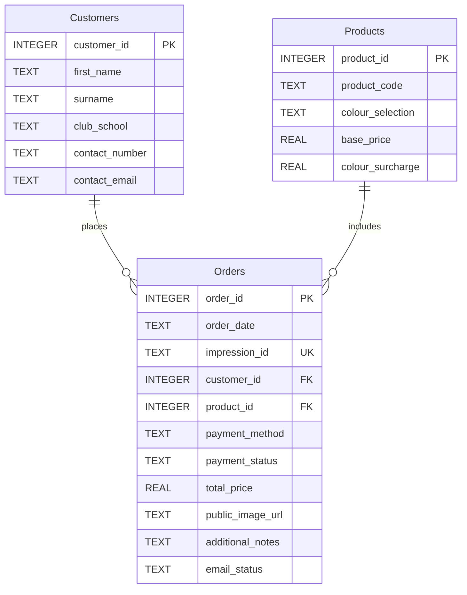

# Automating Snugfit Mouthguards Order Capture & Management System

Snugfit Mouth Guards, located in a dental practice in Sandton, Johannesburg, produces
custom-fitted and personalisable mouthguards for athletes competing in contact sports. In addition to this, and in coordination with the dental practice, they also produce rubberised biteplates, bleaching trays, and retainers.

## Problem Statement

The current order
capturing process entails a combination of paper-based and web-based forms that are
completed and submitted by customers and then captured manually onto an Excel
spreadsheet by reception staff. This process is time-consuming and repetitive, and enables
human error in the data-capturing process, potentially resulting in increased returns and
customer complaints. It is also notable that Snugfit’s website is also outdated and
requires modernisation.

## Solution Deliverables

- **Website:** Full html and CSS website redesign, accommodating the new booking form.
- **Responsive HTML Booking Form:** An online, web-based html form, on `Bookings.html`, that adjusts field entries based on product selection.
- **Automated Order Capture System:** Form submission triggers a Google WebApp to fetch form responses, automatically populating a Google spreadsheet and assigning a unique impression ID.
- **Email API:** Appending a new order row in the Google sheet activates Google Apps Script's service, MailApp, to send a order confirmation email to the customer including their unique impression ID and an order copy email to Snugfit.
- **SQLite Database:** A back-up SQLite database receives order data from the populated Google Sheet row entries upon manual request from `db_create.py`, storing in `snugfit_orders.db`.
- **Data Validation for Production:** Once an order row is marked "Paid" on the Google Sheet, Google Apps Script sends the necessary data corresponding to that order to a printable Google document. This ensures production of paid orders only.
- **Order Dashboard Google Website:** A simple, integrated dashboard for Snugfit staff to view the Google sheet and document on a single user interface (UI).

## Solution Benefits

- Improves website usability, functionality, and marketability.
- Eliminates time inefficiencies associated with the manual order management system and improves order accuracy/data quality.
- Data backed-up on SQLite database and in Google Cloud.
- Improves transaction visibility for both Snugfit and their customers.
- Order dashboard website is simple to understand for staff and requires little training/effort to implement.

## Technologies Used

- **HTML5:** Snugfit website structuring and form.
- **CSS:** Snugfit website styling.
- **JavaScript:**
  - Sending `FormData` to the Google WebApp.
  - Handles the logic of receiving order data, processing it, saving it to Google Sheets and Drive, and sending confirmation emails. 
- **JSON:** Formats the incoming order data from the web form and the response sent back to the web app.
- **Python:** Automates the creation and population of an SQLite database from the Snugfit Order Capture Google Sheet.
- **SQLite:** To set up the database schema, and populate it with data.

## File Setup
<pre>
snugfit/
├── frontend/
│   ├── Home.html                       # Main home page
│   ├── Schools&Clubs.html              # Affiliates page
│   ├── personalise.html                # Personalistion Options page
│   ├── Reviews.html                    # Review Us page
│   ├── Bookings.html                   # Customer booking from
│   ├── ContactUs.html                  # Contact Us page
│   ├── Website Design                  # Visual Assets
│   ├── PDFs                            # PDF Assets
│   │   
├── backend/
│   ├── BookingBackend.js               # Sending FormData to WebApp
│   ├── db_create.py                    # Create db and sync with Google sheets entries
│   ├── snugfit_orders.db               # SQLite database (created after running setup)
│   └── snugfit_orders.sql              # Database schema and sample data
├── GoogleAppScript/
│   ├── GoogleBackendAPI.gs             # recieving data, populating Google documents, & sendig emails
│   └── appsscript.json
└── README.md                           # This file

</pre>

## Automated Order Capture & Management System Demonstration:

1) Open `Home.html` and navigate through website pages using the navbar.
2) Select Bookings (i.e. `Bookings.html`), fill out booking form with test data and a valid email address to receive confirmation email (as customer would when ordering a product).
3) Click Submit, and when directed to `ThankYou.html`, the submission was a success.
4) Check your email inbox for "Your Snugfit Order Confirmation".
5) Open the following Google Website link: [Snugfit Order Dashboard](https://sites.google.com/view/snugfit-order-dashboard/home).
6) Your specific form response should have appended as a new row in the embedded Google sheet. If not, refresh page.
7) To test data validation for production, open the google sheet via the Google Website, and change your order payment status to "Paid". This will append a new row in yellow in the Google document for paid orders (also visible in the Google Website). Yellow rows indicate newly paid orders to be checked before printing.
   - **Note:** The URL saved in the logo column is saved as a Google Drive link, this Drive has been shared with the lecturers.
8) Your paid order is now ready to be data quality checked, printed, and produced.
9) To update the database `snugfit_orders.db`, manually run `db_create.py`. This syncs the populated Google sheet to the database and creates `snugfit_orders.sql`.
    - **Note:** In order for `db_create.py` to fetch the Google sheet data, a Google service account was created and shared with the Google sheet. The `credentials.json` file gives the python file access to the sheet, and shouldn't be shared with anyone to ensure data security.

## Database Setup
### Using SQLite Command Line
1. Using the Powershell one-liner in the project directory
2. Run the SQL command:
<pre> Get-Content snugfit_orders.sql | sqlite3 snugfit_orders.db </pre>   

## Database Schema

The database includes the following:

### Tables:

1) **Customers:** Customer ID and their personal details (name, surname, club/school, contact details)
2) **Product:** Product catalog IDs and corresponding pricing (product code/description, colour, base price, colour surcharge)
3) **Orders:** Order specifications, payment details, and additional information (including order date, unique impression ID (UK), customer ID (FK), and product ID (FK))

### Normalisation:

- This database follows the Third Normal Form (3NF):
1) **1NF:** all of the attributes are atomic with no repeating groups or lists
2) **2NF:** all of the non-key attributes are fully dependent on their table's PK, with no partial dependencies.
3) **3NF:** there are no transitive dependencies

### Relationships:

| Relationship           | Type             | Description                           |
| ---------------------- | ---------------- | ------------------------------------- |
| `Customers → Orders`   | **1-to-Many**    | One customer can place many orders    |
| `Products → Orders`    | **1-to-Many**    | One product can appear in many orders |
| `Customers ↔ Products` | **Many-to-Many** | Resolved using `Orders` junction table  |

### Sample Data

The data contained in the uploaded `snugfit_orders.db` file, contains the order data as captured on the order capture Google sheet. Currently, updating the database to include new sheet entries requires running `db_create.py`. This syncs the populated Google sheet to the database and creates `snugfit_orders.sql`.

## Conclusion

Snugfit Mouthguards currently spends ten minutes manually processing a single order form, and also expressed their need for a more modernised and aesthetic website. The proposed solution, involving a redesigned website with a front and back-end order management system, automates their order capture and data entry processes, eliminating all manual processes for online completed forms, with quality checks remaining the only manual step. This has reduced the processing time for orders from 10mins/order to just 1 min/order, resulting in a 90% time redcution in the order management process, illustrating a dramatic productivity and efficiency improvement. Furthermore, automating the data capture process, eliminates human-error and results in higher data quality. Overall, the proposed solution adds value to the business by enhancing their brand image and marketability through their website, while minimising the inefficiencies experienced with their current order management system.
