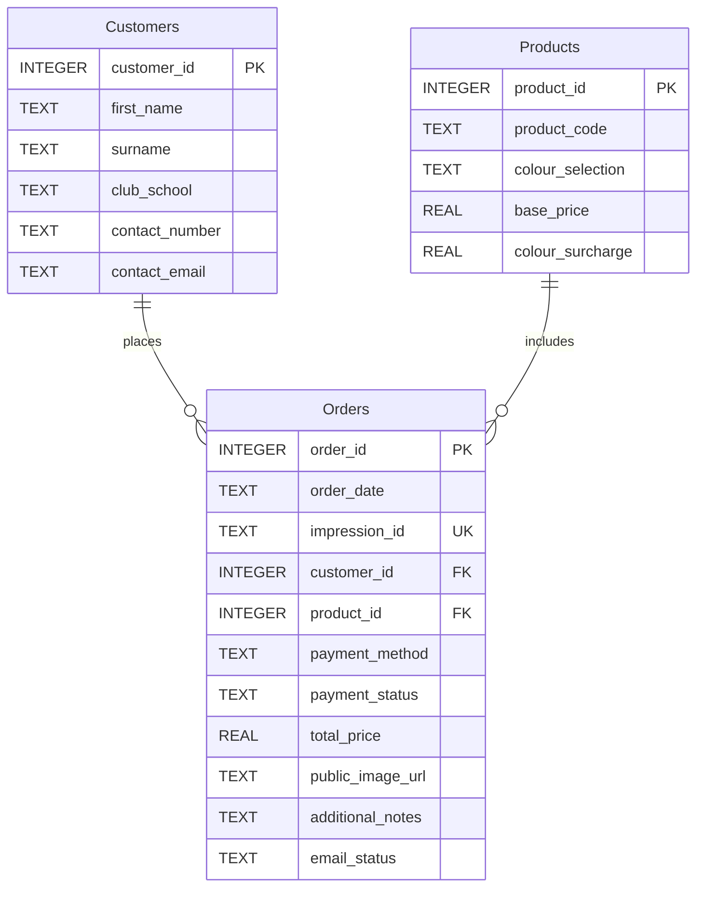

# Automating Snugfit Mouthguards Order Capture & Management System

Snugfit Mouth Guards, located in a dental practice in Sandton, Johannesburg, produces
custom-fitted and personalisable mouthguards for athletes competing in contact sports. In addition to this, and in coordination with the dental practice, they also produce rubberised biteplates, bleaching trays, and retainers.

## Problem Statement

The current order
capturing process entails a combination of paper-based and web-based forms that are
completed and submitted by customers and then captured manually onto an Excel
spreadsheet by reception staff. This process is time-consuming and repetitive, and enables
human error in the data-capturing process, potentially resulting in increased returns and
customer complaints. It is also notable that Snugfit’s website is also outdated and
requires modernisation.

## Solution Deliverables

- **Website:** Full html and CSS website redesign, accommodating the new booking form.
- **Responsive HTML Booking Form:** An online, web-based html form, on `Bookings.html`, that adjusts field entries based on product selection.
- **Automated Order Capture System with Dual Backend:** Form submission triggers a Google WebApp to fetch form responses, automatically populating a Google spreadsheet and assigning a unique impression ID. Additionally, form submission sends payload to a flask proxy API on Render. This is purely to demonstrate REST design for academic purposes and doesn't form part of the company's order management system.
- **Revised Hybrid Unique Impression ID Generation:** The online form automatically updates the 'A00' tab in the Google sheet upon submission, where impression ID starts from 'A01' at the start of a new year. This means a new sheet would be created annually. There is also the option for customers to fill out a paper-based order form that the staff manually enter on the 'M00' tab in the same Google sheet. 
- **Email API:** Appending a new order row in the Google sheet activates Google Apps Script's service, MailApp, to send a order confirmation email to the customer including their unique impression ID and an order copy email to Snugfit.
- **SQLite Database:** A back-up SQLite database receives order data from the populated Google Sheet row entries upon manual request from `db_create.py`, storing in `snugfit_orders.db`.
- **Data Validation for Production:** Once an order row is marked "Paid" on the Google Sheet, Google Apps Script sends the necessary data corresponding to that order to a printable Google document. This ensures production of paid orders only.
- **Order Dashboard Google Website:** A simple, integrated dashboard for Snugfit staff to view the Google sheet and production order document on a single user interface (UI).
- **KPIs:** KPIs have been developed both on the flask proxy API and on Snugfit's order management dashboard (Google Website).

## Solution Benefits

- Improved website usability, functionality, and marketability.
- Eliminates time inefficiencies associated with the manual order management system and improves order accuracy/data quality.
- Data backed-up on SQLite database and in Google Cloud.
- Improves transaction visibility for both Snugfit and their customers.
- Order dashboard website is simple to understand for staff and requires little training/effort to implement.
- KPIs and analystics give real-time updates and will improve decision-making.
- Meets both the company's demand for a simple, Google order management backend, and academic purposes with the flask backend.

## Technologies Used

- **HTML5:** Snugfit website structuring and form.
- **CSS:** Snugfit website styling.
- **JavaScript:**
  - Sending `FormData` to the Google WebApp and the flask proxy API.
  - Handles the logic of receiving order data, processing it, saving it to Google Sheets and Drive, and sending confirmation emails. 
- **JSON:** Formats the incoming order data from the web form and the response sent back to the web app.
- **Python:** Automates the creation and population of an SQLite database from the Snugfit Order Capture Google Sheet.
- **SQLite:** To set up the database schema, and populate it with data.

## File Setup
<pre>
snugfit/
├── frontend/
│   ├── Home.html                       # Main home page
│   ├── Schools&Clubs.html              # Affiliates page
│   ├── personalise.html                # Personalistion Options page
│   ├── Reviews.html                    # Review Us page
│   ├── Bookings.html                   # Customer booking from
│   ├── ContactUs.html                  # Contact Us page
│   ├── Website Design                  # Visual Assets
│   ├── PDFs                            # PDF Assets
│   │   
├── backend/
│   ├── BookingBackend.js               # Sending FormData to WebApp
│   ├── FlaskProxyAPI.py                # Creating proxy flask API to recieve formData on Render
│   ├── requirements.txt                # Requirement for Render setup
│   ├── Procfile                        # Requirement for Render setup
│   ├── SnugfitProxyAPI.postman_collection.json  # testing REST endpoints using Postman
│   ├── db_create.py                    # Create db and sync with Google sheets entries
│   ├── snugfit_orders.db               # SQLite database (created after running setup)
│   └── snugfit_orders.sql              # Database schema and sample data
├── GoogleAppScript/
│   ├── GoogleBackendAPI.gs             # recieving data, populating Google documents, & sendig emails
│   └── appsscript.json
└── README.md                           # This file

</pre>

## Live Links

- **Frontend:** [Snugfit Netflify hosted website](https://snugfit-bfb-group5.netlify.app) & [Snugfit Order Management Google Dashboard](https://sites.google.com/view/snugfit-order-dashboard/home)
- **Backend:**
  - Core Google API: [Source Code](https://script.google.com/d/1WxXGkOj1kxDJh0QMowdrNHAiXJcoC9sci-vKhgWtS9OS2URn0bwtOJl2/edit?usp=sharing)
  - Flask Proxy API: [Snugfit Render](https://snugfit-website-group-5.onrender.com/)

## Render Design:
- **API Endpoint Overview:**

| # | Method | Endpoint | Description |
|---|--------|----------|-------------|
| **1** | `GET` | `/api/orders` | Lists all captured proxy orders from the html booking form. |
| **2** | `POST` | `/api/orders` | Accepts booking-form JSON payload from html booking form submission. |
| **3** | `GET` | `/api/orders/<id>` | Allows retrieval of a single order by impression number/id generated by Google Apps Script. |
| **4** | `PUT` | `/api/orders/<id>` | Allows partial updates of an existing order. |
| **5** | `GET` | `/api/kpis` | Simple derived metrics from captured orders. |
| **6** | `Get` | `/` | Confirms the API is running and lists all the available endpoints. |
| **7** | `Get` | `/health` | Health check endpoint. |

- **KPIs:**

| KPI Name | JSON Field | Meaning / Explanation |
|----------|------------|------------------------|
| **Total Orders** | `total_orders` | The total number of orders currently stored in the proxy API’s in-memory list. |
| **Distinct Product Types Ordered** | `distinct_product_types_ordered` | Counts how many unique product types have been ordered across all orders. |
| **Product Breakdown** | `product_breakdown` | Shows how many orders fall under each product type. |
| **Most Popular Product** | `most_popular_product` | The product type with the highest frequency ordered (the most commonly selected). |

## Google Website KPIs:

| Category | Metric / Chart | Description |
|----------|----------------|-------------|
| **KPIs** | **New Orders Today** | Number of new customer orders created on the current day. |
| | **Monthly Paid Orders** | Count of all orders marked as “Paid” within the current month. |
| | **Annual Paid Orders** | Total number of paid orders across the current year. |
| | **Total Annual Revenue** | Sum of all paid order amounts for the current year. |
| **Charts** | **Monthly Sales Revenue** | Bar chart showing total revenue per month. |
| | **Frequency of Product Type Sold Monthly** | Visual breakdown of how many units of each product type were sold each month. |
| | **Sheet Colour Orders by Month** | Chart showing the distribution of sheet colour selections for each month. |

## Architecture:

- **Justification for using a Proxy Flask API:**
  - Snugfit Mouth Guards requested all backend functionality for the system to be managed in the Google ecosystem using Google Apps Script, Sheets, Drive, and Docs.
  - Google Apps Script `doPost` is a single endpoint and doesn't meet the memo requirements for Flask and a minimum 5 REST endpoints.
  - To satisfy memo requirements, and without altering the working system, a Flask-based proxy API was implemented that returns the submitted form data using order id/impression number as a unique identifier to illustrate the REST principles.
  - In reality, this middleman is unecessary, as Google Apps Script efficiently handles backend functionality on its own.

## Team Contributions

I, Adrian MacKenzie (u23584620), developed and completed the entire project myself from frontend to backend. I completed this BFB 321 project for Snugfit Mouth Guards and took on the challenge of pursuing/satisfying the requirements of both the project memo and the company.

## Automated Order Capture & Management System Deployment Instructions:

| Step | Action | Notes / Links |
|------|--------|---------------|
| 1 | Visit the live frontend | Click [here](https://snugfit-bfb-group5.netlify.app/bookings) to visit the Netlify, live-hosted frontend containing the booking form (which is the starting point of the demonstration). The other web pages, available in the navbar, are also hosted for your viewing. |
| 2 | Fill out the booking form | - choose standard MG as the product at the top. - Use your email address to receive your unique impression number via the email API. - Select a logo from the options to demonstrate sending images through the system. - Click Submit, and when directed to `ThankYou.html`, the submission was a success. |
| 3 | Email API demo | Check your email inbox for "Your Snugfit Order Confirmation" to view a copy of your form response containing your unique impression number “AXX” (this is also displayed in the post-submission Thank You page message). |
| 4 | Render endpoint demo | Check the Render-stored data on your browser using `https://snugfit-website-group-5.onrender.com/api/orders/AXX` , by changing XX to your allocated impression number. This will return a copy of your stored order details. - To check the other endpoints listed earlier, type after `api/`. |
| 5 | Google API demo | Visit this [Snugfit Order Capture Sheet](https://docs.google.com/spreadsheets/d/1CBs1X0cbDWphWTv7IzIriT16uDOZ0-vrXdk0aVnJY-M/edit?usp=sharing) to view your automatically logged order. Your order will have appended as a new row. **Optional:** &nbsp;&nbsp;- Change the payment status of your order to "Paid" (as Snugfit staff would) on the Google Sheet, and then click [here](https://docs.google.com/document/d/1RyQu7pKGFdfKlfkJiudK7VI3eQs-wkmHFmxQPmzAt3Q/edit?usp=sharing) to view your order added as a yellow row to the printable production list Google doc. &nbsp;&nbsp;- View this [Google Drive Logo Folder](https://drive.google.com/drive/folders/1V0sGiBHhb6XiBxmyp3zy34hkz9cqGo5i?usp=sharing) storing the uploaded logos for standard mouth guards. - Your paid order is now ready to be quality checked, printed, and produced by the Snugfit staff. |
| 6 | Staff dashboard | Open the Google Website link, [Snugfit Order Dashboard](https://sites.google.com/view/snugfit-order-dashboard/home), to see the Snugfit staff order dashboard. The Google Sheet and Google doc will be visible with your order. If not, refresh the page. - View the `Analytics` page to see the KPIs and charts based off the Google Sheet data. |
| 7 | Update local database | To update the database `snugfit_orders.db`, manually run `db_create.py`. This syncs the populated Google sheet to the database and creates `snugfit_orders.sql`. - **Note:** In order for `db_create.py` to fetch the Google sheet data, a Google service account was created and shared with the Google sheet. The `credentials.json` file gives the python file access to the sheet and shouldn't be shared with anyone to ensure data security. |

## Database Setup
### Using SQLite Command Line
1. Using the Powershell one-liner in the project directory
2. Run the SQL command:
<pre> Get-Content snugfit_orders.sql | sqlite3 snugfit_orders.db </pre>   

## Database Schema

```mermaid
erDiagram
    Customers {
        INTEGER customer_id PK
        TEXT first_name
        TEXT surname
        TEXT club_school
        TEXT contact_number
        TEXT contact_email
    }

    Products {
        INTEGER product_id PK
        TEXT product_code
        TEXT colour_selection
        REAL base_price
        REAL colour_surcharge
    }

    Orders {
        INTEGER order_id PK
        TEXT order_date
        TEXT impression_id UK
        INTEGER customer_id FK
        INTEGER product_id FK
        TEXT payment_method
        TEXT payment_status
        REAL total_price
        TEXT public_image_url
        TEXT additional_notes
        TEXT email_status
    }

    Customers ||--o{ Orders : "places"
    Products  ||--o{ Orders : "includes"
```
The database includes the following:

### Tables:

1) **Customers:** Customer ID and their personal details (name, surname, club/school, contact details)
2) **Product:** Product catalog IDs and corresponding pricing (product code/description, colour, base price, colour surcharge)
3) **Orders:** Order specifications, payment details, and additional information (including order date, unique impression ID (UK), customer ID (FK), and product ID (FK))

### Normalisation:

- This database follows the Third Normal Form (3NF):
1) **1NF:** all of the attributes are atomic with no repeating groups or lists
2) **2NF:** all of the non-key attributes are fully dependent on their table's PK, with no partial dependencies.
3) **3NF:** there are no transitive dependencies

### Relationships:

| Relationship           | Type             | Description                           |
| ---------------------- | ---------------- | ------------------------------------- |
| `Customers → Orders`   | **1-to-Many**    | One customer can place many orders    |
| `Products → Orders`    | **1-to-Many**    | One product can appear in many orders |
| `Customers ↔ Products` | **Many-to-Many** | Resolved using `Orders` junction table  |

### Sample Data

The data contained in the uploaded `snugfit_orders.db` file, contains the order data as captured on the order capture Google sheet. Currently, updating the database to include new sheet entries requires running `db_create.py`. This syncs the populated Google sheet to the database and creates `snugfit_orders.sql`.

## Conclusion

Snugfit Mouthguards currently spends ten minutes manually processing a single order form, and also expressed their need for a more modernised and aesthetic website. The proposed solution, involving a redesigned website with a front and back-end order management system, automates their order capture and data entry processes, eliminating all manual processes for online completed forms, with quality checks remaining the only manual step. This has reduced the processing time for orders from 10mins/order to just 1 min/order, resulting in a 90% time reduction in the order management process, illustrating a dramatic productivity and efficiency improvement. Furthermore, automating the data capture process, eliminates human-error and results in higher data quality. Overall, the proposed solution adds value to the business by enhancing their brand image and marketability through their website, while minimising the inefficiencies experienced with their current order management system.
